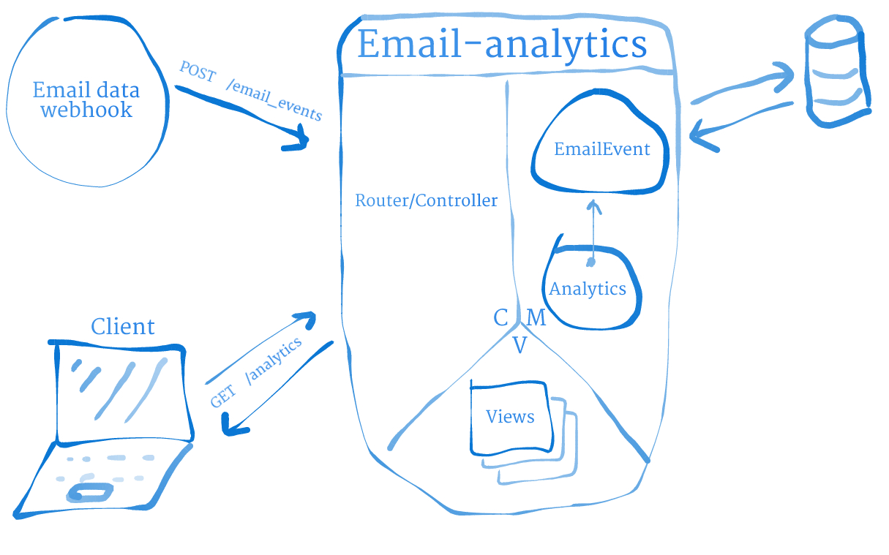

# Domain model

At this stage there are two models: *EmailEvent* and *Analytics*.  
The former is responsible for interacting with ActiveRecord, the latter for returning analytics on the data persisted by *EmailEvent*.

## CRC cards

<table>
  <tr>
    <td colspan="2"><b>EmailEvent</b></td>
  </tr>
  <tr>
    <td>#create_email_event(email_event) extracts email_event columns and persists them</td>
    <td>ActiveRecord</td>
  </tr>
</table>

<table>
  <tr>
    <td colspan="2"><b>Analytics</b></td>
  </tr>
  <tr>
    <td>#calcuate_total(search_parameters) returns total number of email_events for the event type specified in search_parameters</td>
    <td>EmailEvent</td>
  </tr>
   <tr>
    <td>#calculate_rate(search_parameters) returns event rate for the event specified in search_parameters</td>
    <td></td>
  </tr>
  <tr>
    <td>#email_types returns an array of all email types persisted</td>
    <td></td>
  </tr>
</table>
